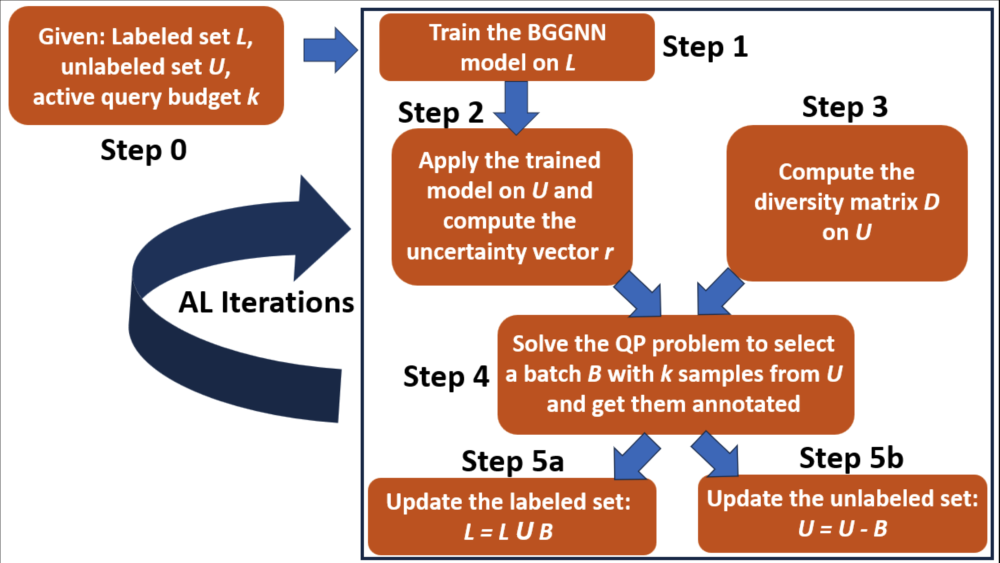
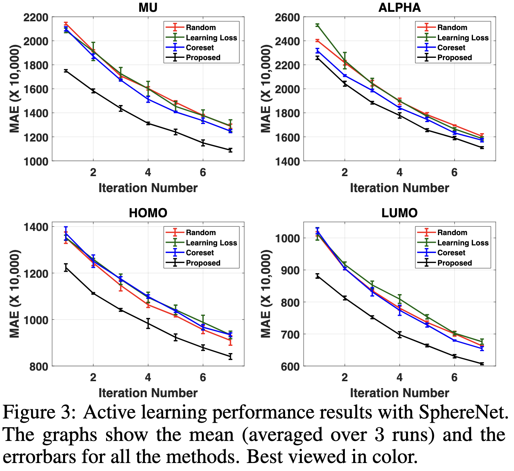

# Empowering Active Learning for 3D Molecular Graphs with Geometric Graph Isomorphism

This repository contains the PyTorch implementation of the paper "**[Empowering Active Learning for 3D Molecular Graphs with Geometric Graph Isomorphism](https://openreview.net/pdf?id=He2GCHeRML)**", R.Subedi\*, L.Wei\*, **W.Gao\***, S.Chakraborty, Y.Liu. NeurIPS, 2024.

In this paper, we present a principled Active Learning (AL) paradigm for 3D molecular learning. We propose a set of new 3D graph isometries for obtaining geometric representations of 3D molecular graphs. We formulate a criterion based on uncertainty (using the Bayesian Geometric Graph Neural Network (BGNN)) and diversity (using our proposed method for representing 3D geometric graphs), and pose active sampling as a Quadratic Programming (QP) problem. Experiments on the 3D molecular datasets(QM9 and MD17) demonstrate the effectiveness of our method compared to the baselines.

_Some part of the codebase is adapted from **[DIG](https://github.com/divelab/DIG?tab=readme-ov-file)** repository._

<p align="center"></p>

## BibTeX
```bash
    @inproceedings{
        subedi2024empowering,
        title={Empowering Active Learning for 3D Molecular Graphs with Geometric Graph Isomorphism},
        author={Subedi, Ronast and Wei, Lu and Gao, Wenhan and Chakraborty, Shayok and Liu, Yi},
        booktitle={The Thirty-eighth Annual Conference on Neural Information Processing Systems},
        year={2024},
        url={https://openreview.net/forum?id=He2GCHeRML}
}
```
# Directory Structure


```

├──  al         - contains code related to Active Sampling methods
│
├──  dataset    - contains data for training
|                  (data needs to be saved in .pt format)
│ 
├──  datasets   - contains code for preparing dataset
│ 
├──  models     - code of baseline models and our BGNN
│   
├──  utils       - contains general utility functions
|
├──  runs       - for saving the results, 
|                the name of folder should be same as selection_method in run.sh file
|
│    └── random  - for random method
│       └── run1
|            └── init_set.npy   - file containing initial labeled indices(user should prepare)
|
│    └── unc_div - for our method
|        └── run1
             └──    tensor.pt  - similarity matrix (compute using compute_sim_mat.py)
|            └── init_set.npy   - file containing initial labeled indices  
|
├── run.sh        - for configuring training hyper parameters
|
|
├── compute_sim_mat.py        - for computing similarity matrix(our and soap method)
|                               * save the obtained tensor.pt file in appropriate folder inside runs/ *
|                               * use the function: compute_uncertainty_diversity_gpu for faster computation*
|
|
├── train.py
```

# Running Experiments
<ul>
    <li> Prepare data in .pt format in [train, valid, test] order.
    <li>Use Linux Environment to run experiments</li>
    <li>Use conda for package management</li>
    <li>Update parameters in <b><i>run.sh</b></i> file as necessary</li>
    <li> Best results will be saved in particular method inside runs folder</li>
</ul>
Processed .pt dataset containing [25000, 10000, 10831] [train, valid, test] samples in order can be downloaded from <a href="https://drive.google.com/file/d/18X_UcsKrNowbbjg9osQsIq_XSLrfPb_m/view?usp=sharing">this link</a>. Initial 5000 labeled samples among 25000 training samples are present in <i>init_set.npy</i> file.

## Command:

 ```
    chmod +x run.sh
    ./run.sh
```

# Extras
<ul>
    <li>For GPU implementation of QP solver use <i><b>compute_uncertainty_diversity_gpu</b></i> function in selection_methods.py file</li>
    <li>For GPU implementation: Check <a href="https://github.com/osqp/cuosqp"> osqp/cuosqp </a> repository for further reference</li>
    <li>Check <a href="https://github.com/dholzmueller/bmdal_reg"> dholzmueller/bmdal_reg </a> repository for using BatchBald selection method</li>
</ul>

# Results

<p align="center"></p>
